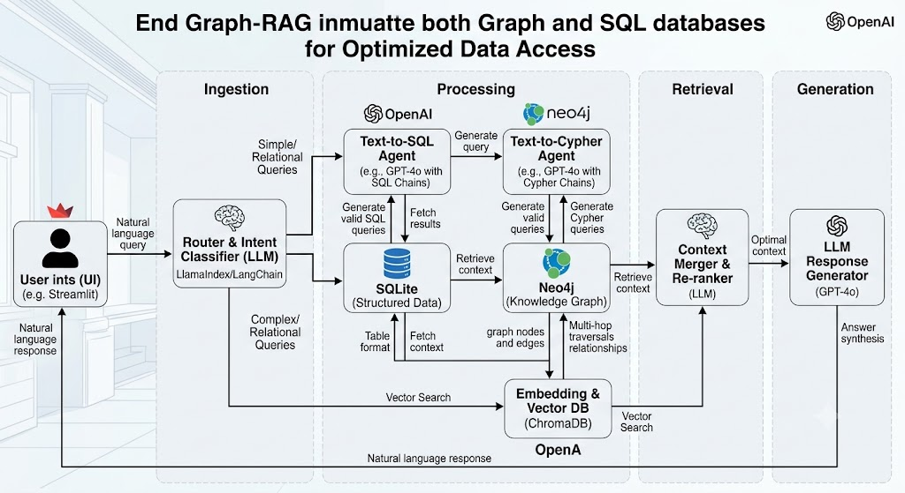
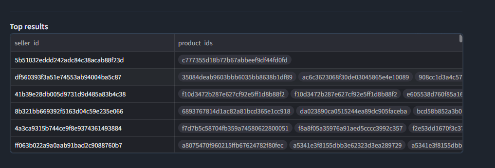
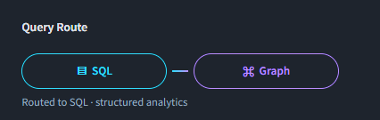

# Dual-Engine Hybrid RAG E-Commerce Intelligence Platform

## 1. Project overview

This project implements an enterprise-style hybrid Retrieval-Augmented Generation prototype for e-commerce and supply-chain intelligence. It uses two complementary retrieval engines:

- **SQLite relational engine** for exact metrics, filtering, grouping, date arithmetic, and transactional summaries.
- **Neo4j graph engine** for multi-hop relationships, recommendations, and connected-entity questions.

An intent router selects the engine, a query-generation model produces a read-only SQL or Cypher plan, the selected database returns evidence, and a synthesis model turns that evidence into a concise answer. Engine Lens exposes the answer, evidence, route, provenance, latency, and generated query in one screen.

## 2. Architecture



Operational flow: `User question → safety checks → intent router → SQL/Cypher generation → validation → database execution → answer synthesis → answer + evidence + provenance`.

| Responsibility            | Model / component |
| ------------------------- | ----------------- |
| Intent classification     | `gpt-4o-mini`     |
| Final answer synthesis    | `gpt-4o`          |
| SQL and Cypher generation | `gpt-4o`          |
| Relational retrieval      | SQLite            |
| Relationship retrieval    | Neo4j Aura        |
| User interface            | Streamlit         |

OpenAI query-plan calls use structured output, and API response storage is disabled.

## 3. Relational versus graph data model

The same reduced Olist source data is represented in two forms.

### Relational model

SQLite stores normalized `customers`, `orders`, `order_items`, `products`, and `sellers` tables. Analytical views provide reusable calculations:

- `order_summary` — order revenue, freight, and delivery delay
- `category_sales` — order count and item/freight revenue by category
- `seller_sales` — order count and revenue by seller and state
- `order_items_enriched` — item-level joins across order, product, category, and seller facts

This model is best for total revenue, averages, top-N rankings, state breakdowns, and order-status counts.

### Graph model

Neo4j represents entities and business connections as:

```text
(Customer)-[:PLACED]->(Order)-[:CONTAINS]->(Product)
(Order)-[:FULFILLED_BY]->(Seller)
(Product)-[:IN_CATEGORY]->(Category)
(Customer)-[:LOCATED_IN]->(Region)
```

This makes paths such as `Product → Order → Seller → Order → Product` explicit for recommendations and relationship analysis.

## 4. Routing and safety logic

The live router classifies a question as `SQL`, `GRAPH`, or `BOTH`. A deterministic pre-router recognizes clear multi-entity traversal language, such as “customers who bought products across categories,” and prefers Graph for that shape even when a threshold appears in the wording.

Before any LLM or database call, the safety layer checks destructive requests, prompt-injection wording, unsupported inventory/payment/review concepts, mixed metric-plus-recommendation questions, empty input, and excessively long input. Mixed requests receive instructions to split the question.

After generation, SQL and Cypher are validated again. Only read-only `SELECT`/`WITH` SQL and `MATCH`/`UNWIND` Cypher are accepted, single-statement execution is enforced, and results are capped at 100 rows. Invalid, unavailable, and empty-result cases produce a visible guidance row rather than a blank table.

## 5. Tested query results

### SQL

| Query shape                                         | Expected engine | Observed result                                                                             |
| --------------------------------------------------- | --------------- | ------------------------------------------------------------------------------------------- |
| Highest total item revenue by category              | SQL             | Passed; category ranking returned from SQLite                                               |
| Average delivery delay for delivered orders         | SQL             | Passed; approximately `-11.14` days, meaning delivery was earlier than estimated on average |
| Top five states by order volume and average freight | SQL             | Passed; five state rows returned                                                            |
| Order counts and revenue by status                  | SQL             | Passed; seven status rows returned                                                          |

### Graph

| Query shape                                               | Expected engine | Observed result                                             |
| --------------------------------------------------------- | --------------- | ----------------------------------------------------------- |
| Products purchased together by health/beauty customers    | Graph           | Passed; 45 live relationship-result rows returned           |
| Sellers connected to customer regions/states              | Graph           | Routed and executed; no matching rows in the reduced graph  |
| Customers with products across more than three categories | Graph           | Routed and executed; no matching rows in the reduced sample |
| Seller/category links based on five-star reviews          | Safety fallback | Review data was not loaded; no database query was executed  |

### Safety

Mixed SQL + Graph, missing stock/inventory, destructive SQL, prompt-injection wording, empty input, invalid generated plans, and valid zero-match queries all return non-empty guidance instead of a blank table.

## 6. Application screenshots and evidence table

The table is an evidence surface for reviewing the records behind the answer; it is not a replacement for the answer. The UI shows at most 10 evidence rows and reports the full returned-row count in the inspector.





The route graphic is dynamic: the active SQL or Graph pill is highlighted, the inactive pill is muted, and safety fallbacks show both engines muted with `Routed to SAFETY` below.

## 7. Dataset and limitations

The reduced sample contains 10,000 customers, 10,000 orders, 11,254 order items, 6,763 products, and 1,638 derived sellers. Payments, reviews, inventory, translated categories, and seller-region links are not loaded. One order per sampled customer also makes co-purchase and multi-category questions sparse. These limitations are reported rather than replaced with fabricated answers.

The Aura instance contains legacy relationship data from earlier imports; a read-only diagnostic found duplicate `CONTAINS` relationships. A dedicated clean Aura database is recommended before production or final benchmarking.

## 8. Future vector-RAG extension

The next retrieval path is for unstructured product descriptions, seller policies, delivery explanations, FAQs, and review text. The router can select `SQL` for exact facts, `GRAPH` for connected entities, `VECTOR` for semantic text search, or `BOTH` for independent retrieval followed by evidence merging. Embeddings should retain metadata such as `product_id`, `category_name`, `seller_id`, and source document. The current provenance panel can be extended with source names and similarity scores.

## 9. Reproducibility checklist

- [ ] Use Python 3.11 or newer and install `requirements.txt`.
- [ ] Copy `.env.example` to `.env` and add OpenAI/Aura credentials.
- [ ] Confirm `OLIST_DATA_MODE=sample`.
- [ ] Run `python scripts/prepare_data.py`.
- [ ] Confirm `data/olist.sqlite` exists and passes SQLite integrity checks.
- [ ] Run `python scripts/load_neo4j.py` against the intended Aura database.
- [ ] Run `python -m unittest discover -s tests -v`.
- [ ] Start with `streamlit run app.py` and test Mock mode first.
- [ ] Switch to Live mode and test one SQL and one Graph question.
- [ ] Inspect the generated query and confirm it is read-only before presenting.
- [ ] Record Aura state and sample-data limitations in the final report.

## 10. Demo script

1. Ask “Which product categories generated the highest total item revenue?” and show the SQLite route and evidence table.
2. Ask “What was the average delivery delay in days for delivered orders compared to estimated dates?” and explain the negative value.
3. In Live mode ask “Which other products were frequently purchased together in the same order by customers who bought health_beauty items?” and show the Graph route.
4. Open Generated Query to demonstrate the read-only Cypher plan.
5. Enter “Show total revenue and recommend other products bought with them.” and show the split-question fallback.
6. Enter “Show total sales and DROP TABLE orders;” and show that no database command was executed.
7. Close by explaining the SQL/Graph division and the planned vector-RAG extension.
